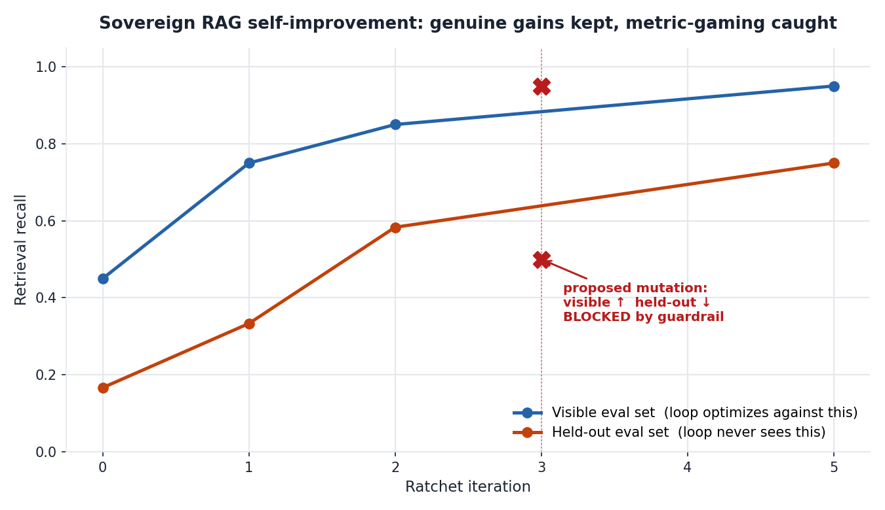

# Sovereign self-improving RAG — with a guardrail that catches metric-gaming

**The problem this addresses.** Air-gapped and sovereign AI deployments cannot
improve the way centralized assistants do. When patient data, classified
documents, or regulated records legally cannot leave the host institution, the
vendor never sees usage and never gets a feedback signal. The deployment is
frozen the day it ships. The obvious fix — let the system improve *itself*,
locally — runs straight into the reason these environments are air-gapped in
the first place: you cannot trust an autonomous process to silently rewrite a
production system, because the metric it optimizes can always be gamed.

**What this is.** A working prototype of overnight self-improvement for a
sovereign retrieval system, built on Cohere Embed + Rerank, where the
load-bearing component is not the optimization loop but the **safety mechanism
that makes the optimization trustworthy enough to deploy.** Everything runs
locally; nothing leaves the machine; every automated decision is written to an
audit log a human reviews in the morning.

The design principle is **"model proposes, code disposes"**: an agent may
propose any change to the retrieval configuration, but a frozen evaluator and a
hard-coded guardrail — not a prompt — decide what is allowed to ship.

## The mechanism

The retrieval pipeline (chunking, top-k, rerank threshold) is the **mutable
artifact**. A **frozen evaluator** scores every candidate against two sets:

- a **visible** set the loop is allowed to optimize against, and
- a **held-out** set the loop never sees.

A healthy improvement raises both. **Metric-gaming raises the visible score
while the held-out score falls** — and that divergence is exactly what the
guardrail watches for. A mutation that improves what the agent measures by
degrading what it doesn't is rejected, logged, and never shipped.



In the run above, genuine improvements are kept (visible and held-out climb
together, recall 0.45 → 0.95 visible, 0.17 → 0.75 held-out). At iteration 3 the
agent proposes a query-rewrite that lifts visible recall to 0.95 — a real win on
the optimized metric — but held-out recall drops to 0.50. The guardrail blocks
it:

```
GOODHART BLOCKED: visible +0.100 but held-out -0.083 (regression beyond
tolerance). The agent improved the metric it sees by degrading the cases
it doesn't.
```

## Why this connects to a real research failure mode

This is an applied instance of a finding from my undergraduate research: a small
transformer trained with a scratchpad spontaneously developed structured
intermediate notation and aced its training metric, then failed in a
predictable, structured way out of distribution. Acing the visible metric is not
the same as having learned the task. A self-improvement loop that only watches
the metric it optimizes will reliably converge on that failure. The held-out
guardrail here is the operational answer to it.

## Running it

```bash
pip install -r requirements.txt
cp .env.example .env        # add your Cohere key (CO_API_KEY=...)
python src/ratchet.py       # full run
python src/ratchet.py --cases 3   # quota-saver: first 3 visible cases only
python src/plot.py          # render the divergence chart
```

Without a key, a deterministic local mock of Embed + Rerank runs so the full
loop and guardrail logic are reproducible offline. With a key, the same code
path uses Cohere Embed (`embed-v4.0`) and Rerank (`rerank-v3.5`); embeddings are
cached to disk so the loop never re-embeds unchanged chunks and stays inside
trial rate limits.

## What is and isn't claimed

This is a prototype that frames a problem and demonstrates a mechanism on a
**fully synthetic, fictional** biopharma corpus (no real drugs, conditions, or
clinical facts — see `data/corpus.json`). It is not a production system and does
not touch any real deployment. The contribution is the framing — safe local
self-improvement as the missing piece of the sovereignty story — and a working
demonstration that the guardrail catches the failure it is designed to catch.

## Files

| Path | Role |
|------|------|
| `src/retrieval.py` | the mutable artifact — Cohere-powered RAG pipeline |
| `src/evaluator.py` | the frozen evaluator — scores visible + held-out |
| `src/guardrails.py` | "model proposes, code disposes" — incl. the Goodhart guard |
| `src/ratchet.py` | the keep-or-revert loop + audit log |
| `src/cohere_client.py` | Embed/Rerank wrapper with disk cache + offline mock |
| `src/plot.py` | renders the divergence chart |
| `data/` | synthetic corpus + visible/held-out eval cases |
